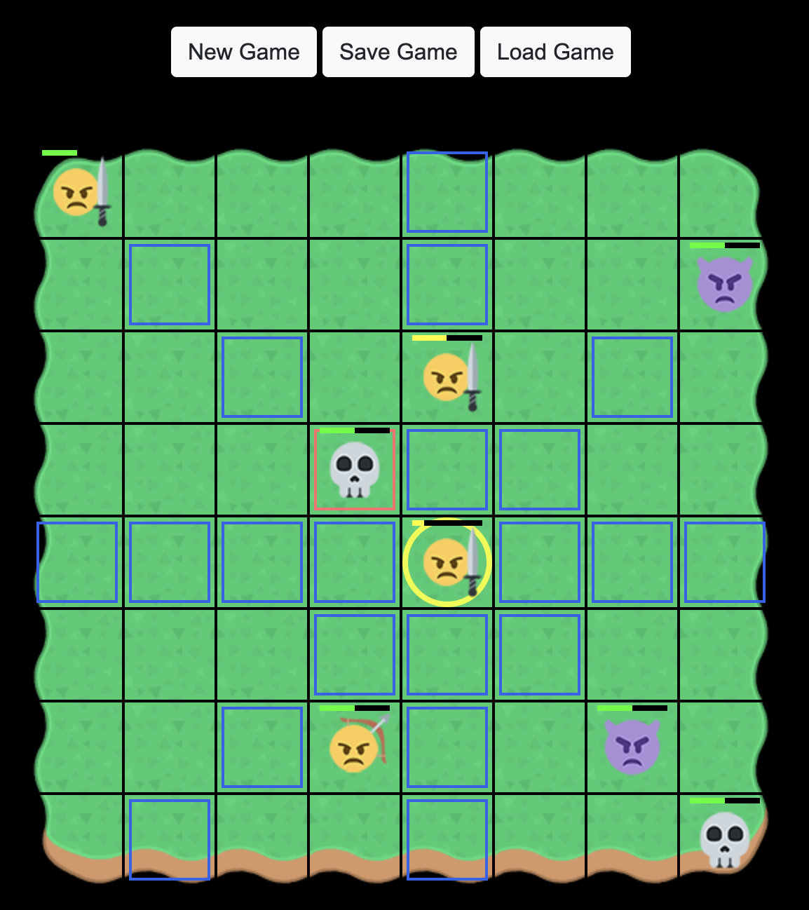
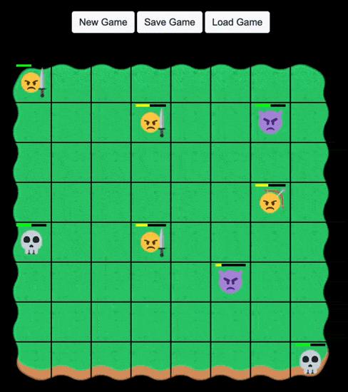
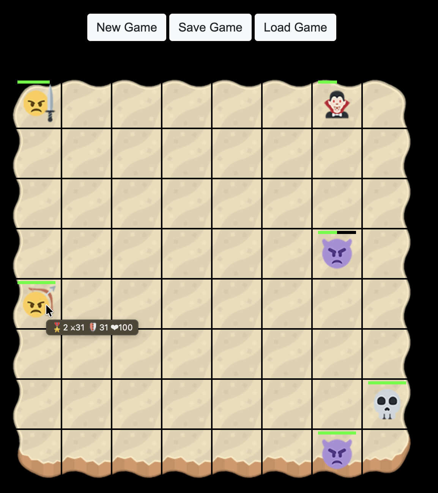
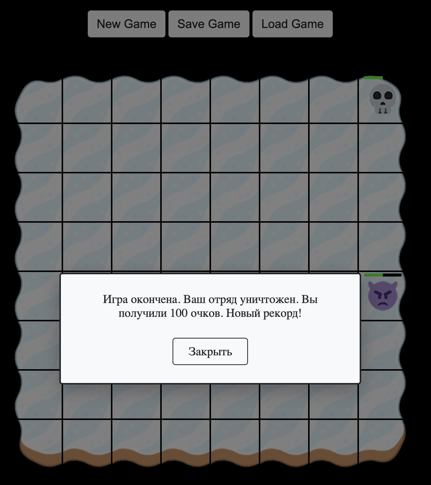

# Retro Game — пошаговая браузерная игра

Retro Game — учебная браузерная игра на JavaScript, в которой игрок управляет отрядом персонажей и сражается с компьютерным противником на поле 8 × 8.

Игра поддерживает развитие персонажей, переходы между уровнями, сохранение и восстановление игрового состояния.

Проект выполнен индивидуально в рамках итоговой работы по модулю «Продвинутый JavaScript: современные возможности языка» Нетологии.

<p align="center">
  
</p>

**[Открыть игру](https://potykalov.github.io/retro-game/)** · [Игровая логика](src/js/Game/GameController.js)

[](https://github.com/potykalov/retro-game/actions/workflows/node-ci.yml)

## Содержание

<p align="center">
  <a href="#основные-возможности">Возможности</a> ·
  <a href="#мой-вклад">Мой вклад</a> ·
  <a href="#технологии">Технологии</a> ·
  <a href="#техническая-реализация">Техническая реализация</a> ·
  <br>
  <a href="#установка-и-запуск">Запуск</a> ·
  <a href="#тестирование">Тестирование</a> ·
  <a href="#демонстрация-игрового-процесса">Демонстрация</a>
</p>

## Основные возможности

- Пошаговые сражения с компьютерным противником.
- Шесть типов персонажей с различными характеристиками.
- Перемещение и атака с учётом дальности действия персонажа.
- Подсветка доступных клеток для перемещения и атаки.
- Развитие персонажей и переход между уровнями.
- Бесконечный цикл уровней с чередованием тем игрового поля.
- Сохранение и загрузка игрового состояния через localStorage.
- Подсчёт очков и отображение результата игры.

## Мой вклад

Проект разработан на основе [учебного задания Нетологии](https://github.com/netology-code/js-advanced-diploma).

В исходном шаблоне были предоставлены интерфейс игры и часть базовых классов.

В ходе выполнения работы я:

- Реализовал игровую логику и обработку действий пользователя.
- Реализовал проверку допустимости перемещения и атаки.
- Разработал алгоритм действий компьютерного противника.
- Добавил развитие персонажей и переходы между уровнями.
- Реализовал сохранение и восстановление игрового состояния.
- Добавил подсветку доступных действий и диалоговые окна.
- Написал тесты на Jest.
- Настроил сборку, линтинг и автоматические проверки.

## Технологии

**JavaScript:** ES Modules, ООП, классы, наследование, генераторы, Promise.

**Browser API:** DOM API, localStorage.

**Инструменты:** Webpack 5, Babel, npm, ESLint, Jest, GitHub Actions.

## Техническая реализация

### Организация игровой логики

Основная логика приложения организована с помощью классов.

| Класс | Назначение |
| --- | --- |
| `GameController` | Обработка действий игрока, правила игры, поведение противника и управление игровым процессом |
| `GamePlay` | Взаимодействие с DOM, отображение игрового поля и анимация |
| `Character` | Базовые характеристики персонажей и логика повышения уровня |
| `GameStateService` | Сохранение и загрузка игрового состояния |

Основные классы были предусмотрены учебным шаблоном и доработаны в ходе выполнения проекта.

**Ключевые файлы реализации:**

- [GameController.js](src/js/Game/GameController.js) — игровая логика и управление ходами.
- [GamePlay.js](src/js/Game/GamePlay.js) — взаимодействие с интерфейсом.
- [Character.js](src/js/Game/Character.js) — базовый класс персонажей.
- [Классы персонажей](src/js/Game/characters/) — характеристики и особенности игровых персонажей.

### Проверка перемещения и атаки

Игровое поле состоит из 64 клеток.

Для проверки действий индекс клетки преобразуется в координаты строки и столбца.

На основе разницы координат определяется расстояние до выбранной клетки и проверяется допустимость действия с учётом характеристик персонажа.

### Поведение компьютерного противника

Компьютер проверяет доступные цели и рассчитывает возможный урон.

При наличии доступных целей выбирается вариант атаки с наибольшим расчётным уроном.

Каждый пятый ход, а также при отсутствии доступных целей, компьютер пытается переместить одного из своих персонажей ближе к персонажу игрока.

При выборе позиции учитываются доступная дальность перемещения и занятость клеток.

### Сохранение игрового состояния

Состояние игры сохраняется в localStorage с использованием JSON.

При загрузке сохранённых данных восстанавливаются экземпляры соответствующих классов персонажей и их характеристики.

Это позволяет продолжить игру и сохранить доступ к методам объектов после загрузки.

При повторном открытии страницы игра автоматически загружает последнее сохранённое состояние из localStorage, если оно доступно.

## Установка и запуск

Для локального запуска необходимы Node.js и npm.

**1. Клонируйте репозиторий**

```bash
git clone https://github.com/potykalov/retro-game.git
cd retro-game
```

**2. Установите зависимости**

```bash
npm ci
```

**3. Запустите приложение**

```bash
npm start
```

После запуска приложение будет доступно по адресу:

http://localhost:8080

## Тестирование

В проекте используется Jest.

Реализованы тесты для проверки классов персонажей, игровой логики, подсказок и отдельных сценариев взаимодействия с игровым полем.

Также проверяются загрузка сохранённого состояния и обработка ошибок загрузки.

**Запуск тестов:**

```bash
npm test
```

**Проверка покрытия:**

```bash
npm run coverage
```

**Проверка кода:**

```bash
npm run lint
```

**Production-сборка:**

```bash
npm run prod
```

В GitHub Actions настроен автоматический запуск тестов, ESLint и production-сборки при изменениях в основной ветке и при создании pull request.

[Посмотреть тесты](src/js/Game/__tests__/) ·
[GitHub Actions](https://github.com/potykalov/retro-game/actions)

## Демонстрация игрового процесса

### Перемещение и атака

<p align="center">
  
</p>

### Переход на следующий уровень

<p align="center">
  
</p>

### Результат игры

<p align="center">
  
</p>

## Лицензия

[Лицензия MIT](LICENSE).

## Автор и контакты

**Дмитрий Потыкалов — Junior Frontend Developer**

[Резюме](https://drive.google.com/file/d/1-FthWK2FrCPop39JiLnkouS1WSrIpZer/view) ·
[Email](mailto:dmitriy.potykalov@gmail.com) ·
[Telegram](https://t.me/dmitriy_potykalov)  ·
[LinkedIn](https://www.linkedin.com/in/potykalov)
